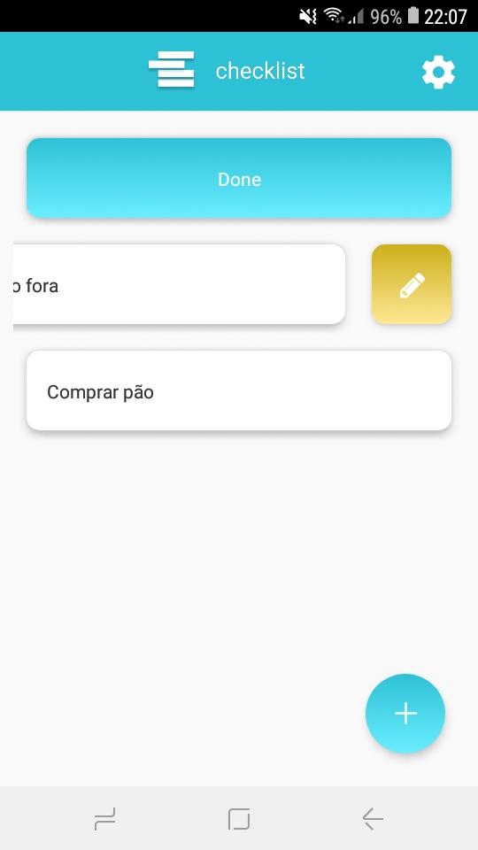
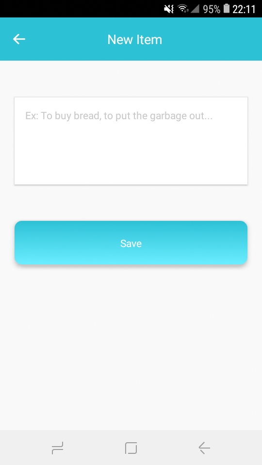
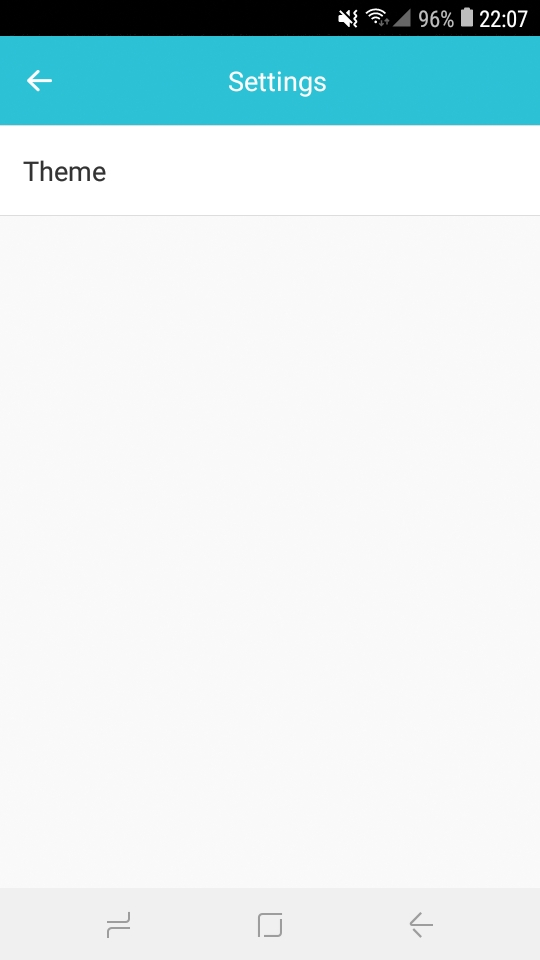
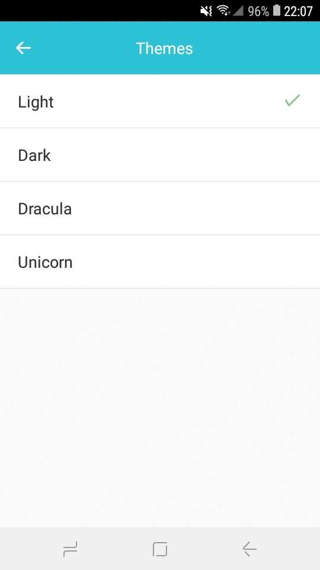

<p align="center">
<br>
    
<br>
<h1 align="center">
    Checklist
</h1>
</p>

<p align="center">✅ A simple mobile checklist made with React Native and Expo</p>

<div align="center">





</div>

## Features

-   ⚛ **React Native** - A JS library that provides a way to create native apps for Android and iOS
-   🔄 **Redux** - A JS library for application state management
-   🔄 **Redux Persist** - A lib that Persist and rehydrate a redux store
-   💅🏿 **Styled Components** - A library that allows you to write CSS code inside JavaScript

[see the themes](./THEMES.md)

## Getting started

### Installation

```
git clone https://github.com/sudo-victor/checklist.git
cd checklist
yarn
```

### Initialization

```
yarn start
```

### Preview

to view just click on the link and scan the QRCode with the expo app.
[preview](https://expo.io/@victor_souto/checklist)

## License

This project is licensed under the MIT License - see the [LICENSE](https://opensource.org/licenses/MIT) page for details.
