

 
    
 
<h1 align="center">
    Checklist Themes
</h1>

✅ A simple mobile checklist made with React Native and Expo

## Light

## Dark

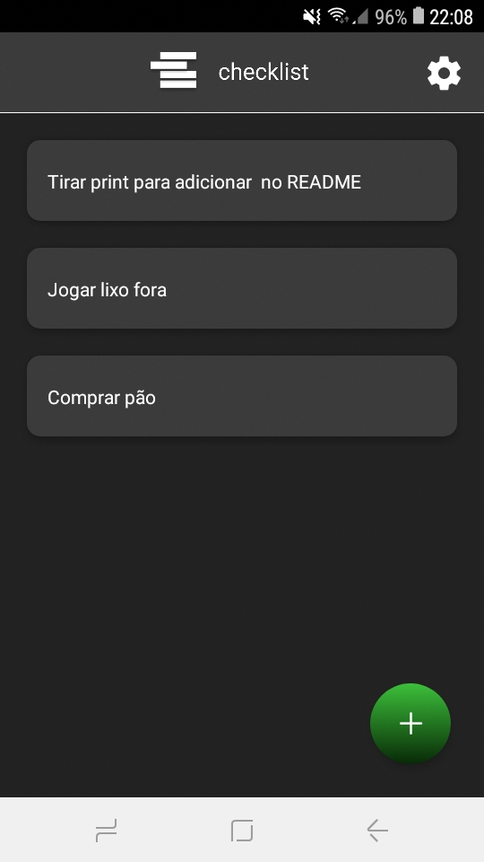
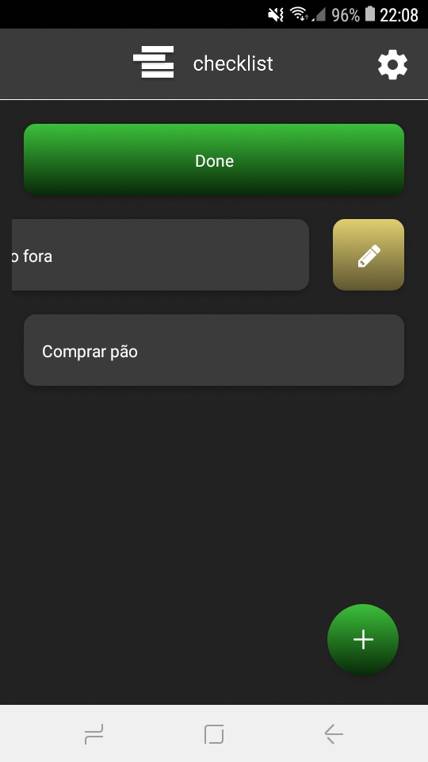
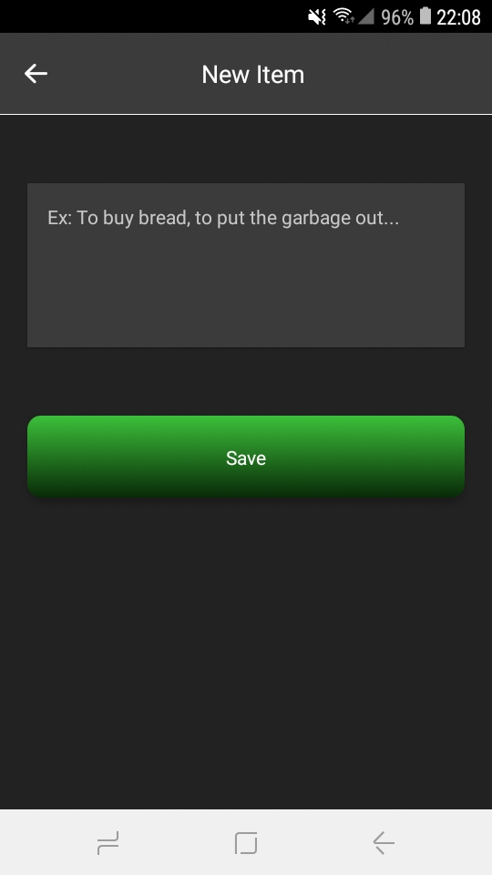
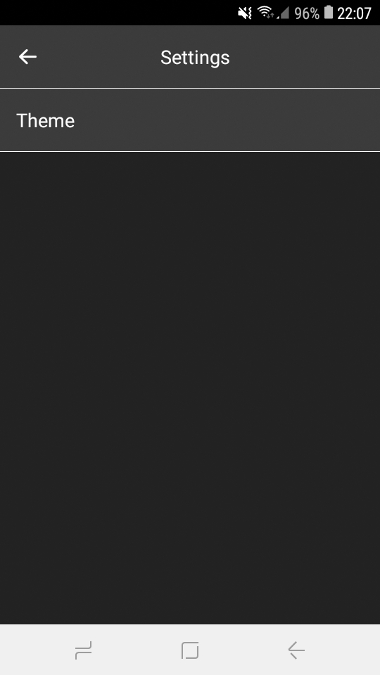
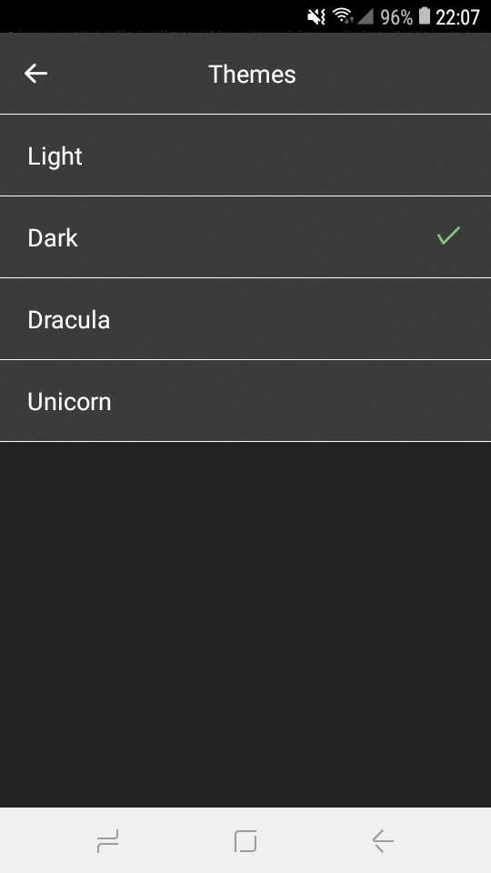

## Dracula

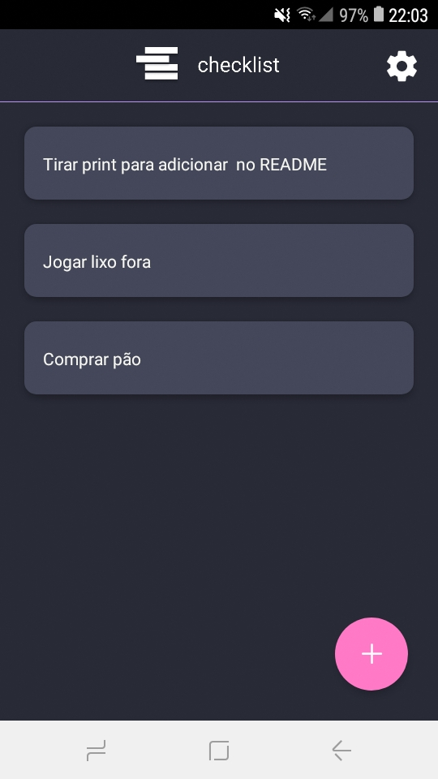
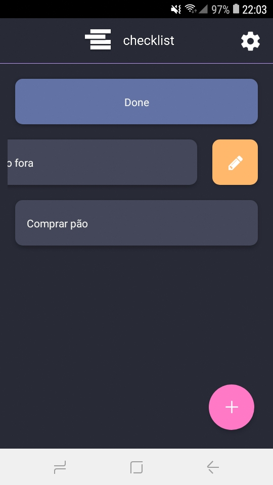
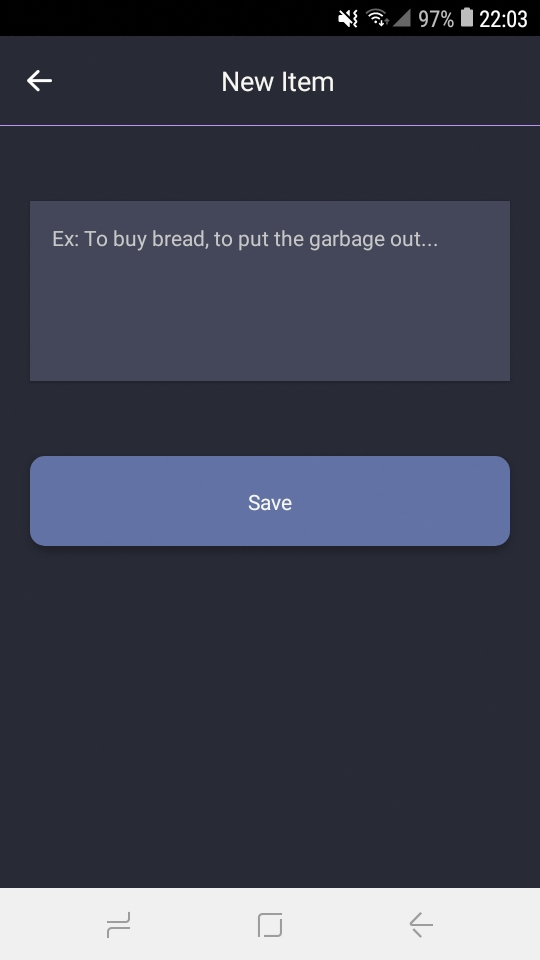
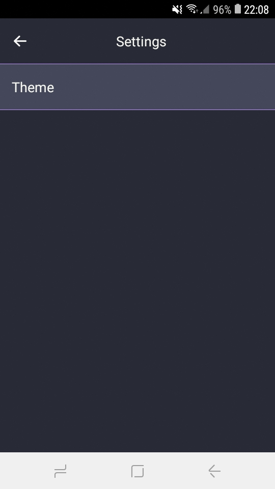
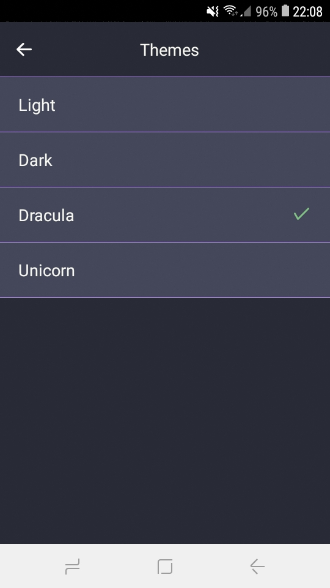

## Unicorn

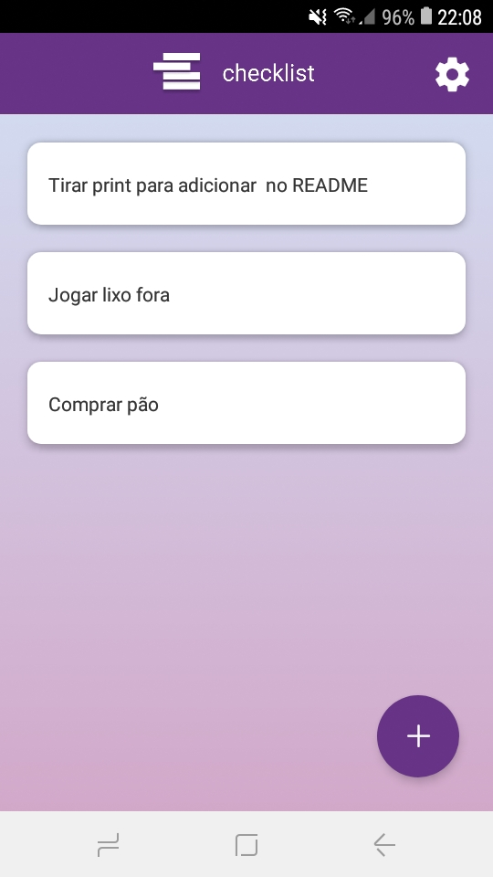
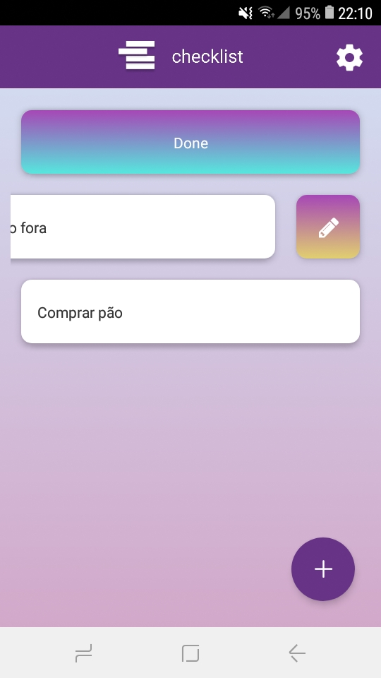
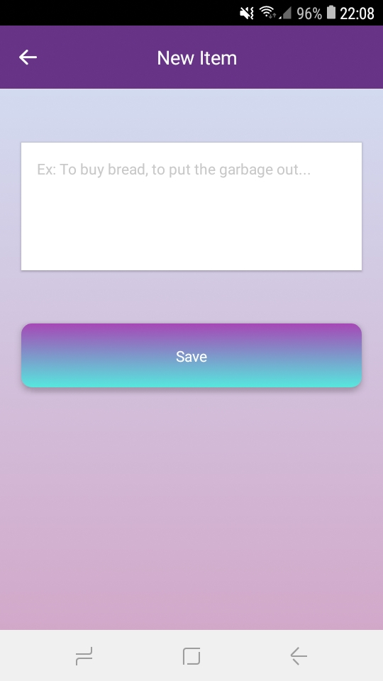
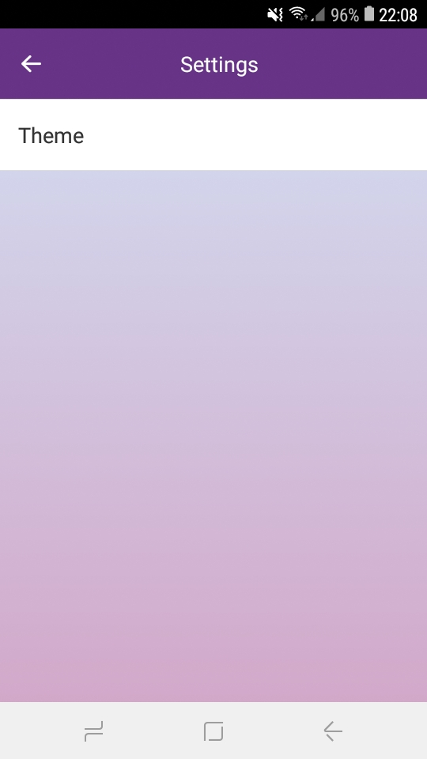
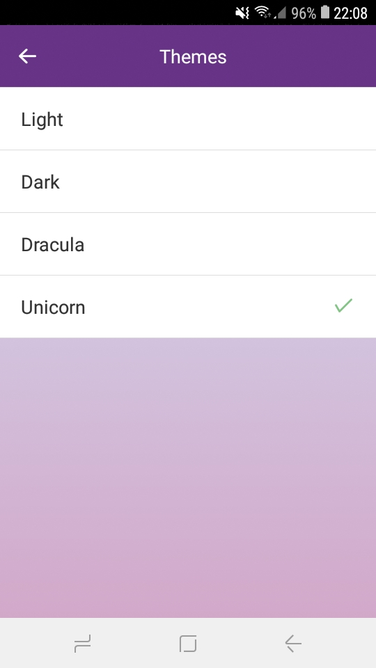

### Preview

to view just click on the link and scan the QRCode with the expo app.
[preview](https://expo.io/@victor_souto/checklist)

## License

This project is licensed under the MIT License - see the [LICENSE](https://opensource.org/licenses/MIT) page for details.
